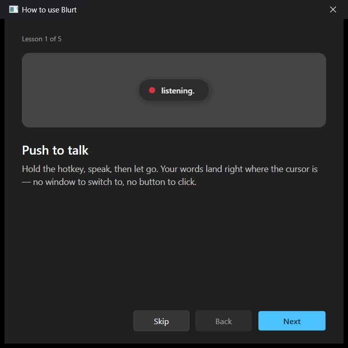
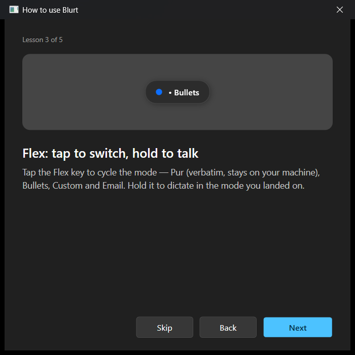
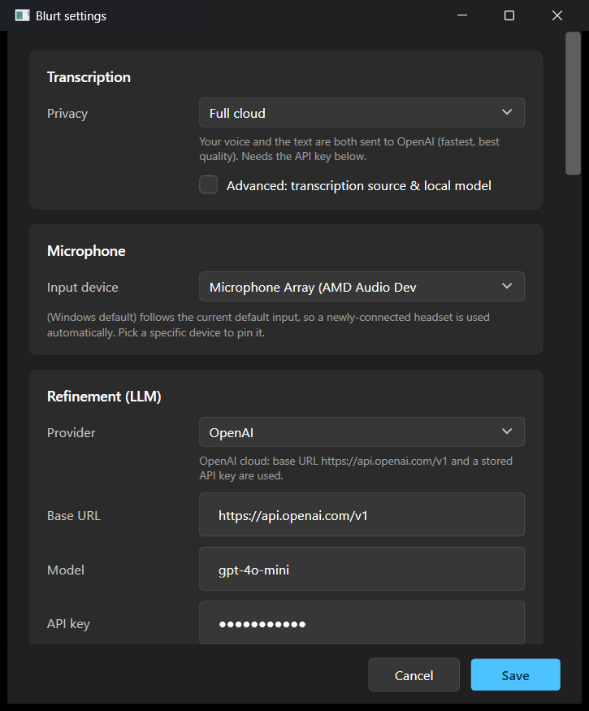

# Blurt

**Push-to-talk voice dictation for Windows.** Hold a key, speak, release — your
words appear at the cursor in whatever app is focused. Optionally cleaned up,
translated, or reshaped by an LLM along the way.

Blurt lives in the system tray, stays out of your way, and is built around one
question that most dictation tools blur over: **what actually leaves your
machine?**

> Status: **experimental** — early, usable, and now open source. Native Windows,
> .NET 8 / C#. Provided as-is: no warranty, no support guarantee, use at your own
> risk. Primary dictation language is German (the multilingual Whisper model
> handles others too).

---

## What it does

You hold a global hotkey, talk, and let go. Blurt records while the key is
down, transcribes the audio to text, optionally refines that text, and pastes
the result at the current cursor position. A small overlay near the mouse shows
the live status — `listening… → transcribing… → fixing…/bulleting…` — and then
disappears. No window to focus, no button to click — it works inside your editor,
browser, chat, mail client, anywhere the cursor is.

There are several **modes**, each on its own hotkey, because "dictation" isn't
one thing — sometimes you want raw text, sometimes a cleaned-up sentence,
sometimes bullets, sometimes English.

## Modes & hotkeys

Push-to-talk on three global hotkeys (all remappable in Settings):

| Hotkey      | Mode      | What you get                                                        |
|-------------|-----------|---------------------------------------------------------------------|
| `AltGr + ,` | **Fix**   | Grammar, punctuation and filler-word cleanup of what you said       |
| `AltGr + .` | **English** | Your speech translated to English                                 |
| `AltGr + -` | **Flex slot** | A cyclable slot — **tap** to switch its mode, **hold** to dictate |

The **flex slot** cycles through four modes when you tap it (an overlay pill
shows you the current one):

- **Pur** — verbatim transcription, **no LLM call, zero network**. The only
  fully offline mode.
- **Bullets** — your dictation reformatted into clean bullet points.
- **Custom** — your own prompt, defined in Settings (e.g. "summarize in one
  sentence", "rewrite in a friendly tone").
- **Email** — turns conversational speech into a well-formed email (greeting,
  body, sign-off). Talk the way you'd talk to a person; out comes the email.

**Tap vs. hold:** a quick tap (under ~250 ms, configurable) on the flex key
cycles its mode; holding it longer records a dictation. The trigger keystroke is
swallowed, so the AltGr special character (`@ € { [` …) never leaks into your
text.

**Also translate to English:** hold **Shift** together with any trigger chord
(e.g. `AltGr + Shift + ,`) and the output is *also* translated to English,
layered on top of the active mode — Fix becomes cleaned-up English, Bullets
become English bullets, an Email becomes an English email. It's a per-dictation
decision (nothing is saved), and it composes with any refined mode. **Pur is
exempt** — the verbatim local path stays zero-network even with Shift held.

## Privacy — own your voice

This is the part Blurt cares about most. The real trust boundary is not
"local vs. cloud" — it's **audio vs. text**. Your *voice* is far more personal
than the *words* it produces. Blurt makes that boundary explicit instead of
hiding it behind technical dropdowns:

| Tier              | Your audio        | Your text         | Voice leaves the machine? |
|-------------------|-------------------|-------------------|---------------------------|
| **Fully local**   | stays local       | stays local (Ollama) | **No** — nothing leaves   |
| **Voice stays home** | stays **local** | → OpenAI          | **No** — only text leaves  |
| **Full cloud**    | → OpenAI          | → OpenAI          | Yes — fastest/best results |

- **Pur is hard-wired to fully local, always.** No matter what else you pick,
  verbatim dictation makes zero network calls. That's a design guarantee, not a
  setting.
- The "voice stays home" tier is the sweet spot for most people: local Whisper
  keeps the recording on your PC, and only the *transcribed text* is sent off
  for refinement.
- In refined modes, **only text is ever sent** to the configured endpoint — the
  audio never crosses the network.

Settings presents this as a single **guided tier choice** — pick the level of
privacy you want and Blurt sets the underlying transcription and refinement
options for you. Each tier spells out, in plain language, whether your voice
leaves the machine. The individual *Transcription Source* and *Refinement
Provider* controls are still there under an **Advanced** disclosure for
non-standard combinations (which then show up as "Custom"). Picking a tier that
sends audio or text to OpenAI makes the API-key requirement explicit right
there in context.

## Speed — local transcription on the GPU

Local transcription runs on your **GPU by default**. Blurt ships the **Vulkan**
whisper runtime and selects it automatically (*GPU acceleration: Auto* in
Settings), falling back to the CPU on machines without a Vulkan driver — no
configuration needed. Even a low-power **integrated** GPU makes local dictation
fast enough to feel instant, and competitive with the cloud.

Rough timings for one ~15-second German dictation on a laptop with an AMD Ryzen 7
4700U and its **integrated** Radeon (Vega) GPU — no discrete graphics card. Single
live runs, so treat these as ballpark, not a benchmark suite:

| Transcription                       | Time     | Your voice      |
|-------------------------------------|----------|-----------------|
| Local · `small` · CPU               | ~14 s    | stays offline   |
| Local · `small` · **GPU (Vulkan)**  | **~3 s** | stays offline   |
| Local · `large-v3-turbo` · **GPU**  | ~15 s    | stays offline   |
| Cloud · OpenAI `whisper-1`          | ~6 s     | leaves your PC  |

- On this integrated GPU the `small` model on Vulkan (~3 s) is **faster than the
  cloud round-trip** (~6 s) — and your audio never leaves the machine.
- The larger `large-v3-turbo` reaches cloud-grade accuracy fully locally; the GPU
  brings it down to about the time the `small` model needs on the CPU.
- Vulkan is roughly **3.5–4× faster than the CPU** here; a discrete GPU widens the
  gap further.

So "keep your voice on your machine" no longer means "wait longer." If your box
has no Vulkan driver, Blurt silently uses the CPU and everything still works.

## Install

Blurt ships as a **portable, self-contained folder** — no installer, no admin
rights, no Program Files, no .NET install required.

1. Download `Blurt-0.3.1-win-x64.zip` from the
   [latest release](https://github.com/salams-code/blurt/releases/latest) and
   unzip the `Blurt` folder anywhere (e.g. `C:\Tools\Blurt`).
2. Double-click `Blurt.exe`.
3. On first launch Windows SmartScreen may show a "run anyway" prompt — the app
   is unsigned for now.

It starts in the system tray. That's it.

> Keep the files together: `Blurt.exe` needs the `runtimes\` folder and the few
> `*.dll` next to it. Move the whole folder, not just the exe.

### First-run onboarding

A short guided setup walks you through:

1. **Microphone** — pick your input and check the level.
2. **OpenAI API key** *(optional)* — step-by-step guide to create one at
   `platform.openai.com`, needed only for cloud transcription/refinement. Stored
   encrypted (see below).
3. **Whisper model** — downloads the local speech model on first run (keeps the
   download small). If your network blocks the download (corporate proxy),
   Settings shows the exact file, a copyable link, and the target folder for a
   manual install.
4. **Hotkeys** — review and remap the three bindings.

After setup, a short **animated tutorial** teaches the gestures — push-to-talk, the
three triggers, and the Flex tap/hold modes — illustrated with the very status pill
you'll see in use. Replay it any time from the tray (**How to use Blurt…**).

<p align="center">
  
  
</p>

After that, Blurt runs silently in the tray.

## Configuration

Everything is in the **Settings** window (right-click the tray icon → Settings):

<p align="center">
  
</p>

- **Privacy tier** — the primary control (see [Privacy](#privacy--own-your-voice)
  above): pick how much leaves your machine, and it sets transcription and
  refinement accordingly. The two knobs below stay available under *Advanced*.
- **Transcription** — local (whisper.cpp on your CPU) or online (OpenAI Whisper
  API), plus the local model: `small` (q5_1, the default — lighter and faster) or
  `large-v3-turbo` (q5_0, larger but more accurate).
- **Refinement** — any OpenAI-compatible endpoint: base URL, model, and (optionally)
  an API key. Pick *with API key* for the OpenAI cloud, OpenRouter, or your own
  authenticated server (the key is sent as Bearer); pick *no key* for Ollama,
  LM Studio, or a keyless server on your network (`http://<host>:11434/v1`). The
  default is OpenAI `gpt-4o-mini` (cheap, fast). Running refinement on your own
  hardware needs **no code change** — the same client speaks to all of them.
- **Hotkeys** — remap the three bindings and the flex-slot mode order.
- **Mode prompts** — edit the system prompt each refined mode uses (Fix,
  English, Bullets, Email, and the flex slot's Custom mode). One button resets
  them all to the shipped defaults; your previous wording is backed up first, so
  you can copy or restore it (Pur has no prompt — it's always verbatim).
- **Start with Windows** — optionally launch Blurt automatically at login (a
  per-user entry, no admin; re-toggle it if you move the Blurt folder).
- **Overlay & sound** — overlay anchor, and an optional start/stop sound (off by
  default, meeting-friendly).

### Where your data lives

- `%APPDATA%\Blurt\config.json` — non-secret settings.
- **API key** — stored separately and **DPAPI-encrypted** (current-user scope).
  Never written in plaintext; only your Windows user can read it.
- `%APPDATA%\Blurt\models\` — downloaded Whisper model(s).
- `%APPDATA%\Blurt\logs\blurt.log` — a small, self-rotating diagnostic log (handy
  if something misbehaves; capped in size so it never grows unbounded).

## Security review

A dictation tool sits in a sensitive spot: it holds your **API key**, sees every
word you dictate, and listens to your microphone — so "what leaves your machine?"
only means something if the machine side is sound. Before going public, Blurt's
attack surface — credential handling, network egress and TLS, clipboard and text
injection, the global keyboard hook, supply chain and native library loading, and
local files/logging — was put through a **read-only, AI-assisted audit** using
Claude Code's multi-agent workflow (more than 70 sub-agents, 77 in all, that
mapped the surface, hunted for issues, then adversarially cross-checked each
finding). It only read the code and changed nothing.

It surfaced **no critical and no high-severity issues**, and found no realistic
path to code execution, credential theft, or silent data exfiltration in normal
use. Overall risk came out **medium**, driven by a handful of low/medium hardening
gaps — and that reassuring half does not stand alone: some hardening is still
**ongoing**, and a few residual risks are simply **inherent** to any single-user
desktop app — a process already running as your Windows user can read whatever
your user can read, Blurt included. Those are documented and accepted, not "fixed."

The practically fixable gaps are hardened in this same change-set. At a category
level: tighter rules on where the API key may be sent and enforcing HTTPS for the
key-bearing endpoint, sanitising injected text, bounding network response sizes,
crash-resistant config loading, recording less in the crash log, pinning
dependencies to a locked source, and keeping dictation text out of the OS
clipboard history.

This kind of automated review **complements but does not replace** a professional
human security audit — treat it as diligence, not a guarantee. Blurt stays
**experimental and is provided as-is**, with no warranty. The detailed findings
are kept private and this note stays general on purpose; if you think you've found
a security problem, please report it privately rather than opening a public issue.

## How it works (under the hood)

```
Hold hotkey ─▶ record mic (NAudio)
   release  ─▶ transcribe (local whisper.cpp / OpenAI Whisper) ─▶ raw text
                    │
            mode == Pur? ──yes──▶ paste at cursor   (zero network)
                    │no
              refine(raw text, mode prompt) ─▶ final text ─▶ paste at cursor
```

A few deliberate technical choices:

- **Low-level keyboard hook** (`WH_KEYBOARD_LL`), not `RegisterHotKey` — that's
  the only way to get push-to-talk (key-up) and tap-vs-hold, and to swallow the
  trigger key so AltGr characters don't leak.
- **Text injection** saves your clipboard, sets the text, simulates `Ctrl+V`,
  then restores the clipboard — so pasting doesn't clobber what you'd copied.
- **Fail-soft everywhere.** No mic, transcription error, endpoint unreachable,
  paste blocked by the target app — each degrades to a notice instead of
  crashing. Where it makes sense it recovers: a cloud transcription that can't
  reach the network falls back to a local model so the dictation still lands, an
  unreachable refiner falls back to the raw transcript, and a blocked paste
  leaves the result on the clipboard.

### Tech stack

.NET 8 / C# · WPF (settings + overlay) · WinForms `NotifyIcon` (tray) ·
[Whisper.net](https://github.com/sandrohanea/whisper.net) (local transcription, Vulkan GPU with CPU fallback) ·
[NAudio](https://github.com/naudio/NAudio) (audio) · `System.Net.Http` for the
OpenAI-compatible refinement endpoint.

The codebase is split so the logic is testable headless: a `Blurt.Core` library
(mode prompts, flex-slot cycling, config + DPAPI round-trip, the
OpenAI-compatible client, tap/hold thresholds) with unit tests, and a thin
`Blurt.App` shell for the OS-bound parts (hooks, mic, injection, overlay) that
can only be exercised by hand on Windows.

## Build from source

You need the **.NET 8 SDK**. Run the tests:

```powershell
dotnet test tests/Blurt.Core.Tests
```

Produce the portable, self-contained build:

```powershell
dotnet publish src/Blurt.App/Blurt.App.csproj `
    -c Release -r win-x64 --self-contained true `
    -p:PublishSingleFile=true -p:IncludeNativeLibrariesForSelfExtract=false `
    -p:EnableCompressionInSingleFile=true -p:DebugType=none `
    -o publish/Blurt-Portable
```

This bundles the .NET runtime and the managed assemblies into a single
`publish/Blurt-Portable/Blurt.exe` that runs on any Windows x64 machine with no
.NET installed, leaving the native libraries in a `runtimes\` folder next to it.

> **Keep `IncludeNativeLibrariesForSelfExtract=false`.** The native whisper
> DLLs must stay on disk beside the exe — Whisper.net probes that folder to load
> them. A *true* single-file build (extracting natives to a temp dir) breaks
> local transcription. `Blurt.exe --selftest` is a quick smoke test that the
> native whisper runtime loads (writes PASS/FAIL/SKIP to
> `%TEMP%\blurt-selftest.txt`).

See [CLAUDE.md](CLAUDE.md) for the full developer setup, including the no-admin
user-profile SDK install (useful on a locked-down/corporate machine).

## Roadmap

Deliberately **not** in scope for now: streaming/chunked transcription with live
incremental insertion (revisited after real-world use of cloud refinement),
emoji/tone modes, user accounts, a backend server, code signing, an installer.

## Background & credits

Blurt is a ground-up Windows reimplementation inspired by **Blitztext**, the
macOS dictation app by Christoph Magnussen
([cmagnussen/blitztext-app](https://github.com/cmagnussen/blitztext-app),
Swift/SwiftUI + WhisperKit). Blitztext is Apple-only, so none of its code runs
on Windows — only the *concept* carried over, and this is a new, native-Windows
codebase with its own architecture. Credit to Christoph Magnussen for the
original idea.

**On a Mac?** Use [Blitztext](https://github.com/cmagnussen/blitztext-app) — it's
the original and the natural fit there. Blurt exists to bring the same workflow
to Windows.

## License

[MIT](LICENSE) © 2026 SLM Solutions.
